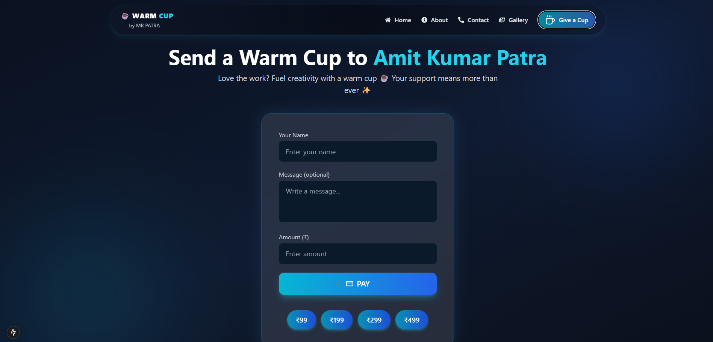

# Warm Cup ☕ — Creator Support 

**Warm Cup** is a modern, dark-themed platform designed to help creators (developers, artists, musicians, writers, etc.) receive support from their audience. Inspired by "Buy Me a Coffee," it brings a premium **Dark Glassmorphism** design, smooth animations, and a seamless user experience

Creators can showcase their work, answer questions, and receive direct support—one warm cup at a time.




---

## 🚀 Features

### 🌟 Core Experience
- **Premium UI**: Stunning dark mode with glassmorphism effects and smooth gradients.
- **Responsive Design**: Fully optimized for Desktop, Tablet, and Mobile.
- **Animations**: Powered by `framer-motion` for fluid interactions.
- **Dynamic Navbar**: Smart sticky navigation with mobile drawer.

### 📄 Pages & Functionality
- **Home**: Hero section, features showcase, and community highlights.
- **Give a Cup**: Direct payment integration via Razorpay with "Quick Amount" buttons.
- **About**: Creator profile and personal story.
- **[NEW] Gallery**: A rich grid layout to showcase creative projects and portfolios.
- **[NEW] FAQ**: Accordion-style Frequently Asked Questions page.
- **[NEW] Contact**: Dedicated contact page with a glass-styled form and social links.
- **Legal**: Terms & Conditions, Privacy Policy, Refunds & Cancellations.

---

## 🛠️ Tech Stack

- **Framework**: [Next.js 14](https://nextjs.org/) (App Router)
- **Styling**: [TailwindCSS](https://tailwindcss.com/)
- **Animations**: [Framer Motion](https://www.framer.com/motion/)
- **Icons**: [Lucide React](https://lucide.dev/) & [React Icons](https://react-icons.github.io/react-icons/)
- **Payments**: Razorpay Payment Pages integration

---

## 🔐 Environment Variables

To run this project, you will need to add the following environment variables to your `.env` file in the `warmcup` directory:

```env
MONGODB_URI=your_mongodb_connection_string
NEXTAUTH_SECRET=your_nextauth_secret
NEXTAUTH_URL=http://localhost:3000
RAZORPAY_KEY_ID=your_razorpay_key_id
RAZORPAY_KEY_SECRET=your_razorpay_key_secret
```

---

## ⚡ Getting Started

1.  **Clone the repository:**
    ```bash
    git clone https://github.com/your-username/warmcup.git
    cd warmcup
    ```

2.  **Install dependencies:**
    ```bash
    npm install
    ```

3.  **Set up Environment Variables:**
    Create a `.env` file in the root directory of the app (inside `warmcup/`) and add the variables listed above.

4.  **Run the development server:**
    ```bash
    npm run dev
    ```

5.  **Open [http://localhost:3000](http://localhost:3000)** in your browser.

---

## 📂 Project Structure

```bash
warmcup/
├── app/                  # Next.js App Router
│   ├── about/            # About Page
│   ├── contact/          # Contact Page
│   ├── faq/              # FAQ Page
│   ├── gallery/          # Gallery Page
│   ├── legal/            # Legal Pages (Privacy, Terms, Refunds)
│   ├── paymentpage/      # Payment Integration
│   ├── layout.js         # Root Layout
│   └── page.js           # Home Page
├── components/           # Reusable Components
│   ├── Navbar.js         # Responsive Navigation
│   ├── Footer.js         # Global Footer
│   └── PaymentPage.js    # Payment Logic
└── public/               # Static Assets
```

---

## 🚀 Deployment

The easiest way to deploy your Next.js app is to use the [Vercel Platform](https://vercel.com/new?utm_medium=default-template&filter=next.js&utm_source=create-next-app&utm_campaign=create-next-app-readme) from the creators of Next.js.

Check out our [Next.js deployment documentation](https://nextjs.org/docs/deployment) for more details.

---

## 🤝 Contributing

Contributions are welcome! Feel free to open issues or submit pull requests for new features, bug fixes, or design improvements.

---

## 📝 License

This project is licensed under the MIT License.

---

<p align="center">
  Built with 💙 and ☕ by <strong>Amit Kumar Patra</strong>
</p>
